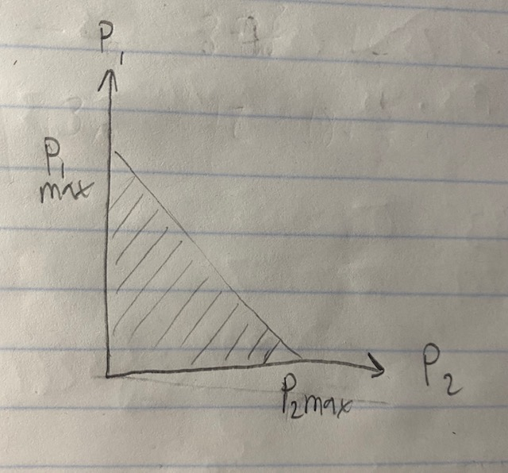

# Question 1
First we find the Gradient

$$ \bigtriangledown_x (2x_1^2 -4-x_1 x_2 +1.5x_2^2 +x_2) \=  \begin{pmatrix}4x_1-4x_2\\
 -4x_1+3x_2+1\end{pmatrix} $$
  
 Using this we can show that the stationary point is where the gradient is equal to zero by setting the gradient equal to zero and solving for x_1 and x_2. This gives us the stationary point as (1,1)
 Next we want to find the eigenvalues and to do this we use the hessian. 
 
 $$ H = \begin{pmatrix}4&-4\\
 -4&3\end{pmatrix}$$
 
 Then we find the eigen values 
 
 $$   \left|\begin{pmatrix}4 - \lambda &-4\\
 -4&3- \lambda\end{pmatrix} \right| = 0 $$
 
 Solving for the eigen values gives us
 
 $$ \lambda = \pm \frac{7+\sqrt{65}}{2} $$
 
 Because we have a positive and a negative eigen value at our stationary point, we know the point must be a saddle point.
 
 In order to find the directions of downward slope, we start with
 
 $$ f(x_1, x_2) = f(1,1) + g(1,1)(\partial X) + 1/2 \begin{pmatrix}\partial x_1&\partial x_2\end{pmatrix} \begin{pmatrix}4&-4\\
 -4&3\end{pmatrix}  \begin{pmatrix}\partial x_1 \\
 \partial x2\end{pmatrix}$$
 
 $$ with\  \partial x_i = x_i - 1$$

If we solve for f(X) -f(X_0) and simplify some terms, we get

$$ f(X) -f(X_0) = 4\partial x_1^2-8\partial x_1 \partial x_2+3 \partial x_2^2= (2 \partial x_1 - 3 \partial x_2)(2 \partial x_1 - 1 \partial x_2)$$

Therefore the slope is downward for any set of X values which satisfies the question 

$$(2 (x_1 - 1) - 3 (x_2 - 1))(2 (x_1 - 1) - 1 (x_2 - 1)) < 0 $$

# Question 2

## Part A
This problem can be rewritten as 

$$ min \ \sqrt{ (x_1 +1)^2 + (x_2)^2 + (x_3 -1)^2} $$

$$S.T.\ x_1+2x_2+3x_3 = 1$$

We can simplify the objective by removing the square root and we can remove the constraint by substituting the contraint into the objective as such:

$$ min \  (2-2x_2-3x_3)^2 + (\frac{1-x_1-3x_3}{2})^2 + (\frac{-x_1-2x_2}{3})^2 $$

We can prove this is a convex objective by finding the eigen values:

$$ g(X) = \begin{pmatrix}2\left(\frac{1-x_1-3x_3}{2}\right)\cdot -\frac{1}{2}+2\left(\frac{-x_1-2x_2}{3}\right)\cdot -\frac{1}{3}\\
2\left(2-2x_2-3x_3\right)\cdot -2+2\left(\frac{-x_1-2x_2}{3}\right)\cdot -\frac{2}{3}\\
2\left(2-2x_2-3x_3\right)\cdot -3+2\left(\frac{1-x_1-3x_3}{2}\right)\cdot -\frac{3}{2}\end{pmatrix}$$

$$H = \begin{pmatrix}\frac{1}{2}+\frac{2}{9}&\frac{4}{9}&\frac{3}{2}\\
\\frac{4}{9}&8+\frac{8}{9}&12\\
\\frac{3}{2}&12&18+\frac{9}{2}\end{pmatrix}$$

 $$\left|\begin{pmatrix}\frac{1}{2}+\frac{2}{9} - \lambda &\frac{4}{9}&\frac{3}{2}\\
\\frac{4}{9}&8+\frac{8}{9}- \lambda &12\\
\\frac{3}{2}&12&18+\frac{9}{2}- \lambda \end{pmatrix} \right| = 0 $$

$$ λ\approx 0.54108\dots ,λ\approx 2.00000\dots ,λ\approx 29.57002\dots $$ 

Therefore the hessian is P.D. and therefore the objective is convex

## Part B
See attached  files

# Question 3

A hyperplane can be written as 

$$ a^T x = c$$

which we can find the gradient and then the hessian for:

$$ \bigtriangledown_x  a^T x \=   a^T$$

$$H(a^T) = 0 \ (zero\ matrix) $$

Because H = 0, the eigen values would all equal 0, and therefore the hessian is P.S.D, meaning the plane must be convex. This can also be determined logically by thinking of a plane in any dimension. They will all be linear and therefore must be convex.

# Question 4

## Part A
For a problem to be convex the objective and the domain must be convex.
The domain of the fucntion is 

$$ 0 \leq p_i \leq p_{max} $$

to prove this we could analyze a system where i = 1, 2. Therefore we have 2 lights. 

We can graph the domain of p values for each light as below

clearly this is a convex domain. As the number of lights increases this domain enters more dimensions, but the same principles apply and the domain remains convex.

Now we need to prove the objective is convex. The objextive is:

$$ {max}_k \ (a_k^T p, I_t) $$
